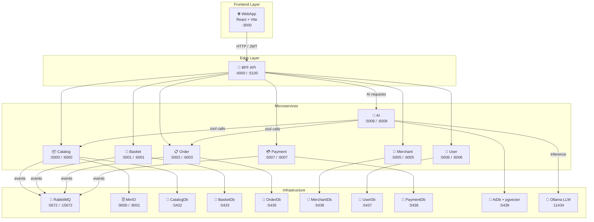

# 🛒 MarketSpace

A modern, cloud-native **e-commerce marketplace** built with a microservices architecture.  

MarketSpace provides a scalable and modular platform for managing catalogs, baskets, orders, merchants, users, payments, and an **AI assistant** — all orchestrated behind a BFF (Backend For Frontend) and served through a responsive React web application.

---

## 🏗️ Architecture Overview



---

## 🧩 Microservices

| Service | Local Port | Description |
|---|---|---|
| **Catalog API** | `5000` | Product listings, categories, stock management, images (MinIO) |
| **Basket API** | `5001` | Shopping cart and item management |
| **Order API** | `5003` | Order creation, tracking, and status updates |
| **Merchant API** | `5005` | Merchant/seller profile management |
| **User API** | `5006` | Authentication (JWT), registration, and user accounts |
| **Payment API** | `5007` | Payment processing and transaction management |
| **AI API** | `5008` | AI assistant: Chat, Agent (tool-calling), and RAG |
| **BFF API** | `4000` | Aggregates all microservices for the frontend |

---

## 🤖 AI Features

MarketSpace includes a built-in AI assistant powered by a locally-running LLM (Ollama), accessible from the customer interface via a chat drawer.

### Three AI Modes

| Mode | Description |
|---|---|
| **💬 Chat** | General-purpose conversational assistant for MarketSpace questions |
| **🛠️ Agent** | Tool-calling agent that queries real data (orders, catalog) on behalf of the user |
| **📚 RAG** | Retrieval-Augmented Generation using vector embeddings for knowledge base Q&A |

### Agent Tools

| Tool | Description |
|---|---|
| `GetOrderStatus` | Fetches a specific order by ID from Order API |
| `GetOrdersByCustomer` | Lists all orders for the authenticated customer |
| `SearchProducts` | Searches the product catalog |

### AI Technology

| Component | Technology |
|---|---|
| LLM runtime | [Ollama](https://ollama.com/) |
| Language model | `llama3.2:1b` (chat-tuned) |
| Embedding model | `nomic-embed-text` |
| Vector store | PostgreSQL + [pgvector](https://github.com/pgvector/pgvector) |
| Auth propagation | JWT claims injected at BFF — user identity never sent from frontend |

---

## 🗂️ Project Structure

```
marketspace/
├── src/
│   ├── Services/
│   │   ├── Ai/               # AI microservice (Chat, Agent, RAG)
│   │   ├── Basket/           # Basket microservice
│   │   ├── Catalog/          # Catalog microservice
│   │   ├── Merchant/         # Merchant microservice
│   │   ├── Order/            # Order microservice
│   │   ├── Payment/          # Payment microservice
│   │   └── User/             # User microservice (JWT auth)
│   ├── Edges/
│   │   └── BackendForFrontend.Api/  # BFF — auth gateway & aggregator
│   └── BuildingBlocks/
│       ├── BuildingBlocks/          # Shared abstractions, logging, auth helpers
│       └── BuildingBlocks.Storage/  # MinIO storage abstraction
├── infra/
│   ├── MarketSpace.AppHost/         # .NET Aspire App Host
│   ├── MarketSpace.ServiceDefaults/ # .NET Aspire Service Defaults + Polly
│   └── ollama/                      # Ollama Docker setup + pgvector init SQL
├── ui/
│   └── marketspace-ui/              # React 19 + TypeScript frontend
├── tests/                           # Integration & unit tests
├── docs/                            # Documentation and port mappings
├── scripts/                         # Utility scripts
├── docker-compose.yml               # Full-stack Docker Compose
└── MarketSpace.sln
```

---

## 🛠️ Technology Stack

### Backend (.NET / C#)

| Technology | Purpose |
|---|---|
| **.NET 10 / C#** | Core language for all services and BFF |
| **ASP.NET Core (Minimal APIs)** | REST API framework |
| **.NET Aspire** | Service orchestration, observability, and resilience defaults |
| **Entity Framework Core** | ORM with value objects and domain model mapping |
| **PostgreSQL 17** | Relational database (one isolated instance per service) |
| **pgvector** | Vector extension for PostgreSQL — stores and queries AI embeddings |
| **RabbitMQ** | Async messaging and event-driven communication between services |
| **MinIO** | S3-compatible object storage for product images and files |
| **JWT / ASP.NET Identity** | Authentication and authorization |
| **Serilog** | Structured logging with console sink and enrichers |
| **Polly** | Resilience pipelines (retry, circuit breaker, timeouts) via Aspire |
| **Ollama** | Local LLM runtime (no cloud API required) |
| **Swagger / OpenAPI** | API documentation for each service |

### Frontend (React / TypeScript)

| Technology | Purpose |
|---|---|
| **React 19** | UI library |
| **TypeScript 5** | Type-safe JavaScript |
| **Vite 7** | Build tool and dev server |
| **TailwindCSS v4** | Utility-first CSS framework |
| **shadcn/ui + Radix UI** | Accessible, unstyled UI component primitives |
| **TanStack Router** | Type-safe, file-based client-side routing |
| **TanStack Form + Zod** | Form management and schema validation |
| **Zustand** | Lightweight global state management |
| **Axios** | HTTP client for BFF communication |
| **Lucide React** | Icon library |
| **Sonner** | Toast notification library |

### Infrastructure & DevOps

| Technology | Purpose |
|---|---|
| **Docker / Docker Compose** | Containerization and local orchestration |
| **Nginx** | Static file serving for frontend container |

---

## 🚀 Getting Started

### Prerequisites

- [Docker](https://www.docker.com/) & Docker Compose
- [.NET 10 SDK](https://dotnet.microsoft.com/) (for local development)
- [Node.js](https://nodejs.org/) 20+ (for UI development)

> **⚠️ AI Service requires Ollama**  
> The Ollama container downloads and serves the `llama3.2:1b` and `nomic-embed-text` models automatically on first start. This requires at least **6 GB of free RAM** allocated to Docker.

### Run with Docker Compose

```bash
# Clone the repository
git clone https://github.com/fsmaiorano/marketspace.git
cd marketspace

# Start all services (infrastructure + microservices + frontend)
docker compose up --build
```

Once running:

| Service | URL |
|---|---|
| WebApp (UI) | http://localhost |
| BFF API | http://localhost:5100 |
| Catalog API | http://localhost:6000 |
| Basket API | http://localhost:6001 |
| Order API | http://localhost:6003 |
| Merchant API | http://localhost:6005 |
| User API | http://localhost:6006 |
| Payment API | http://localhost:6007 |
| AI API | http://localhost:6008 |
| RabbitMQ Management | http://localhost:15672 |
| MinIO Console | http://localhost:9001 |
| pgAdmin | http://localhost:5050 |
| Ollama | http://localhost:11434 |

### Frontend Development (local)

```bash
cd ui/marketspace-ui
cp .env.example .env   # Set VITE_API_URL=http://localhost:4000
npm install
npm run dev
```

---

## 📡 Event-Driven Messaging

Asynchronous communication between services uses **RabbitMQ**:

| Publisher | Event | Consumer(s) |
|---|---|---|
| Basket API | `BasketCheckout` | Order API |
| Order API | `OrderCreated` | Payment API, Catalog API |
| Catalog API | `CatalogStockUpdated` | BFF (cache invalidation) |
| Catalog API | `StockReservationFailed` | Order API, Payment API |
| Payment API | `PaymentStatusChanged` | Order API, Catalog API |

---

## 🔐 Authentication

- **User API** issues signed **JWT tokens** with user ID, name, and email claims.
- All BFF endpoints require a valid JWT (`Bearer` token).
- The **BFF injects the authenticated user's identity** into AI and service requests — the frontend never sends user IDs directly.

---

## 📄 License

This project is open-source. See the repository for more details.
